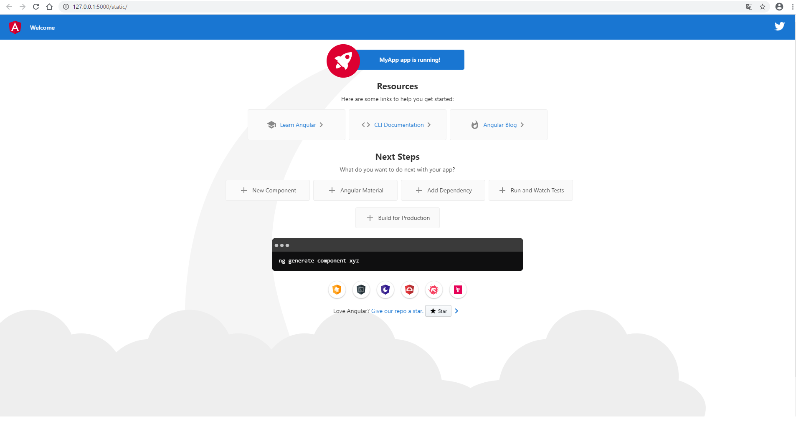

# AngularとFlask開発環境構築

pycharmインストール  
https://www.jetbrains.com/ja-jp/pycharm/

Node.jsインストール  
https://nodejs.org/ja/

|#|コマンド|バージョン|環境|
|---|---|---|---|
|#1|node --version|v12.14.1|macOS 10.14|
|#2|npm --version|6.13.4|〃|

`※macOSで構築、Windows10でも検証済`

①コマンド「[sudo] npm install -g @angular/cli」を実行する

⚠️以下のエラーが発生した場合
````
npm WARN checkPermissions Missing write access to /usr/local/lib/node_modules
npm ERR! code EACCES
npm ERR! syscall access
npm ERR! path /usr/local/lib/node_modules
npm ERR! errno -13
npm ERR! Error: EACCES: permission denied, access '/usr/local/lib/node_modules'
npm ERR!  [Error: EACCES: permission denied, access '/usr/local/lib/node_modules'] {
npm ERR!   stack: "Error: EACCES: permission denied, access '/usr/local/lib/node_modules'",
npm ERR!   errno: -13,
npm ERR!   code: 'EACCES',
npm ERR!   syscall: 'access',
npm ERR!   path: '/usr/local/lib/node_modules'
npm ERR! }
npm ERR! 
npm ERR! The operation was rejected by your operating system.
npm ERR! It is likely you do not have the permissions to access this file as the current user
npm ERR! 
npm ERR! If you believe this might be a permissions issue, please double-check the
npm ERR! permissions of the file and its containing directories, or try running
npm ERR! the command again as root/Administrator.

npm ERR! A complete log of this run can be found in:
npm ERR!     /Users/********/.npm/_logs/2020-01-11T10_39_14_992Z-debug.log
````

以下のコマンドを実行する(npmのデフォルトディレクトリを作成する)
````
mkdir ~/.npm-global
npm config set prefix '~/.npm-global'
echo ' export PATH=~/.npm-global/bin:$PATH' >> ~/.bash_profile
source ~/.bash_profile
````

②コマンド「ng new [プロジェクト名]」を実行する  
※ディレクトリ構成「helloworld/MyApp/」
````
Would you like to add Angular routing? Yes
Which stylesheet format would you like to use? CSS
※必要に応じて適宜選択する
````

⚠️ngがインストールされていて、「bash: ng: command not found」が出力された場合
````
コマンド「alias ng="/Users/********/.npm-global/lib/node_modules/@angular/cli/bin/ng"」を実行する  
※ng="〜"はインストールした場所によって変わるため、適宜変更する。  
「npm install -g @angular/cli」を実行時にインストール場所がターミナルに表示されているはずなので、それを入力する。
````

③pythonファイルを作成（flaskパッケージをインストールしておく※pip install flask）  
※ディレクトリ構成「helloworld/app.py」

`app.py`
````
from flask import Flask, render_template

app = Flask(__name__)


@app.route('/')
def hello():
    return render_template('index.html')


app.run()
````

④ディレクトリ「/static/」、「/templates/」を作成する

|#|ディレクトリ構成|
|---|---|
|#1|helloworld/static/|
|#2|helloworld/templates/|

⑤コマンド「ng build --base-href /static/」を実行する  
※コマンド実行時のカレントディレクトリは「helloworld/MyApp」

⑥ビルドしたファイルをコピーする

|#|対象ファイル|コピー先ディレクトリ|
|---|---|---|
|#1|helloworld/MyApp/dist/MyApp/*.js|helloworld/static/|
|#2|helloworld/MyApp/dist/MyApp/*.map|〃|
|#3|helloworld/MyApp/dist/MyApp/index.html|helloworld/templates/|

⑦app.pyを実行し、ブラウザでlocalhostに接続する


