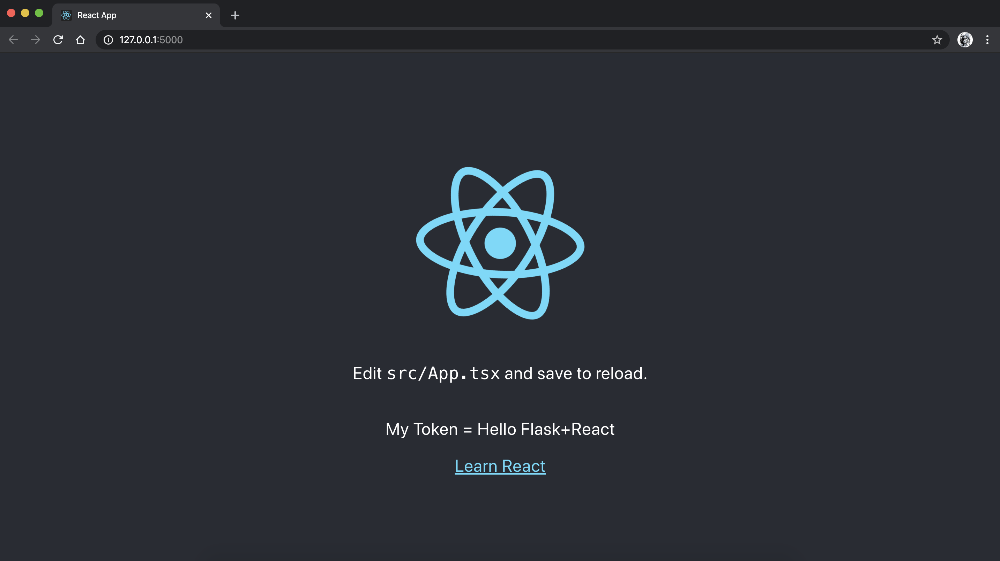

# ReactとFlask開発環境構築

pycharmインストール  
https://www.jetbrains.com/ja-jp/pycharm/

Node.jsインストール  
https://nodejs.org/ja/

Yarnインストール  
- `npm install -g yarn`  
- もしくは、HomebrewからYarnをインストール(macOSのみ)  
  - https://brew.sh/index_ja  
  `/usr/bin/ruby -e "$(curl -fsSL https://raw.githubusercontent.com/Homebrew/install/master/install)"`
  - https://legacy.yarnpkg.com/ja/docs/install#mac-stable  
  `brew install yarn`

|#|コマンド|バージョン|環境|
|---|---|---|---|
|#1|node --version|v12.14.1|macOS 10.15|
|#2|npm --version|6.13.6|〃|
|#3|yarn --version|1.21.1|〃|


`※macOSで構築`

①pythonファイルを作成（flaskパッケージをインストールしておく※pip install flask）  

`main.py`
````
import flask

app = flask.Flask("__main__")


@app.route("/")
def my_index():
    return flask.render_template("index.html", token="Hello Flask+React")


app.run(debug=True)
````

②ディレクトリ「/static/」、「/templates/」を作成する

|#|ディレクトリ構成|
|---|---|
|#1|project/flask-backend/static/|
|#2|project/flask-backend/templates/|
|#3|project/flask-backend/main.py|

③reactの設定

- コマンド実行
```
yarn global add create-react-app react-scripts
npx create-react-app react-frontend --typescript
cd react-frontend/
npm run eject
※? Are you sure you want to eject? This action is permanent. (y/N) y
```

- ファイル修正

|#|対象ディレクトリ|対象ファイル|修正前|修正後|
|---|---|---|---|---|
|#1|project/react-frontend/config/|`paths.js|appBuild: resolveApp('build'),`|`appBuild: resolveApp('../flask-backend/static/react'),`|
|#2|〃|webpack.config.js|*|「static/」で検索、すべて置換|
|#3|〃|〃|`new HtmlWebpackPlugin(Object.assign({},{inject: true,template: paths.appHtml,`|`new HtmlWebpackPlugin(Object.assign({},{inject: true,template: paths.appHtml,filename: "../../templates/index.html",`|
|#4|project/react-frontend/public/|index.html|-|`<script>window.token = "{{token}}"</script>`を追加|
|#5|〃|〃|-|`declare global { interface Window {token: any } }`を追加|
|#6|project/react-frontend/src/|App.tsx|-|`<header className="App-header">`内に`<p>My Token = {window.token}</p>`を追加|
|#7|project/react-frontend/|package.json|-|`"homepage": "/static/react",`を追加|

- ビルド
```
npm run build
```

④main.pyを実行し、ブラウザでlocalhostに接続する


